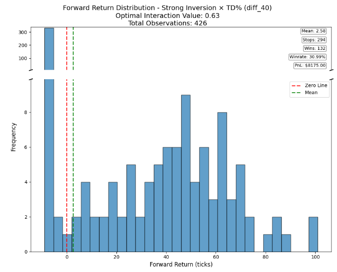

<div>

  # Trading Data Analytics

  

  Market microstructure analysis system for E-mini S&P 500 futures using footprint, Auction Market Theory (AMT), and statistical validation to identify trading opportunities.
  
</div>

## Overview

Processes 8-tick bar footprint data to detect reversals based on significant orderflow signals. Analyzes "Inversion" and "Exhaustion" patterns occurring within 12 ticks of support/resistance levels derived from Time-Price Opportunity (TPO) profile analysis.

## Signal Detection

### Inversion Signals
Detects trapped traders when footprint bars close opposite to their delta direction:
- **Standard**: Bar closes against delta % direction
- **Strong**: Net delta closes within 75% of bar's high/low wick

### Exhaustion Signals
Identifies momentum fatigue through volume tapering:
- **2x**: 50% volume reduction between consecutive price levels
- **Accelerated**: 50% to 20% volume reduction

### Metrics

| Metric | Formula | Purpose |
|--------|---------|---------|
| Delta % | `Delta ÷ Volume` | Directional aggression intensity |
| Trapped Delta % | `Cumulative Delta ÷ Minimum Delta` | Trapped trader exposure |
| Vol* | `Current Volume ÷ 50-bar Rolling Avg` | Volume multiple vs average |
| TD% | `Close ÷ Low` (Buy) / `Close ÷ High` (Sell) | Entry timing relative to bar structure |

## Level-Based Filtering

### Composite Value Areas (CVA)
Merges multi-session TPO profiles to create support/resistance levels:
- **Balance Areas**: Overlapping value areas from 2+ sessions forming D-shaped distributions
- **Levels**: Value area high/low of composite merges
- **12-Tick Rule**: Signals trigger only within 12 ticks of levels

## Data Pipeline

### Input Processing (`process_footprint_data.py`)
- **Source**: Sierra Chart CSV exports
- **Content**: OHLC, datetime, footprint bar data, study data, orderflow signals
- **Stop-Loss**: Entry bar Low/High ± 1 tick, depending on long/short

### Statistical Analysis (`footprint_signal_analysis.py`)
- **Regression**: Interaction testing for signal combinations
- **Validation**: P-value < 0.05, minimum 30 interactions
- **Forward Returns**: Bins - 5, 10, 20, 30, 40, 50, 75, 100 bars
- **Performance**: Win criteria at 25+ ticks, PnL at $12.50/tick

### Processing Pipeline
```
Raw Data → Signals → Levels → Returns → Validation
    ↓         ↓        ↓        ↓         ↓
OHLC/Vol  Inversion   BAs   8 periods  Regression
Delta     Exhaustion  12-tick Stop/MFE Interactions
```

### Performance
- **Coverage**: 250 trading days
- **Session**: 8:30 AM boundaries
- **Processing**: Multi-core optimization
- **Memory**: Optimized for high-frequency datasets

## Directory Structure

```
trading-data-analytics/
├── README.md
├── analysis/
│   ├── process_footprint_data.py        # Data processing & signals
│   └── footprint_signal_analysis.py     # Statistical analysis
├── data/
│   ├── ES_8tick_250D.csv                # Raw Sierra Chart export
│   └── 8_tick_inv_and_ex.csv            # Processed signals + returns
├── images/
│   └── output_plot_example.png
└── requirements.txt
```
